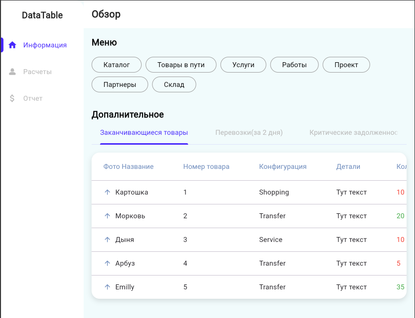
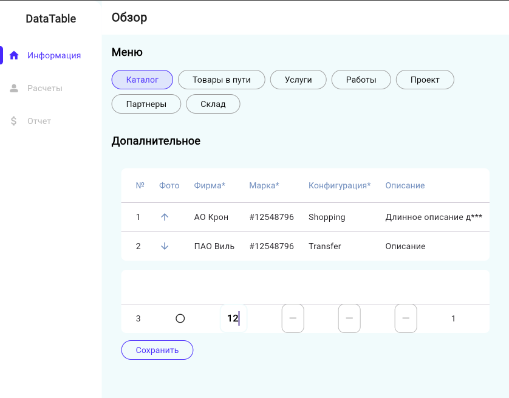

# 📊 Flutter Table App (Desktop & Web)

A responsive and feature-rich **Flutter Table App** built for both **desktop** and **web platforms**. This app provides an elegant, interactive data table that supports various features like sorting, scrolling, theming, and more — ideal for business dashboards, reports, and management tools.

## 🚀 Overview

This project demonstrates the power and flexibility of Flutter when building data-centric applications. The table is optimized for desktop and web views and adapts to various screen sizes. It’s suitable for any use case where structured data display is needed.

## 🌟 Features

- 💻 **Multi-platform Support**: Works seamlessly on Flutter **Web** and **Desktop** platforms.
- 🧱 **Responsive Table Layout**: Adapts to different screen sizes and orientations.
- 🌗 **Dark & Light Themes**: User-friendly appearance for both bright and low-light environments.
- 📋 **Row & Column Styling**: Custom cell rendering for better data visualization.
- 📌 **Sticky Headers**: Makes navigation through large data sets easier.
- 🔍 **Search & Filter Ready**: Easy integration for search and filtering features.

## 🛠️ Built With

- [Flutter](https://flutter.dev/) – Cross-platform UI framework
- [Dart](https://dart.dev/) – Programming language used in Flutter
- Custom table widgets and layout logic

## 📥 Installation

Make sure you have Flutter installed. Then run the following:

```bash
git clone https://github.com/focusdev2024/flutter-table-app.git
cd flutter-table-app
flutter pub get
flutter run -d chrome  # for web
flutter run -d windows # or macos/linux depending on your desktop OS

```

## 🖼️ Screenshots

Here’s a visual preview of the app:

| Screenshot 1 | Screenshot 2 |
|--------------|--------------|
|  |  |

| Screenshot 3 |
|--------------|
|  |

---

## 🧪 Usage

After launching the app:

- ✅ View and scroll through the interactive data table.
- 🖥️ Resize the window or browser to test responsiveness.
- 🌗 Toggle between light and dark mode.
- 🔌 Optionally integrate with real data or APIs.

---

## 🤝 Contributing

We welcome contributions from developers of all levels!  
To contribute:

1. Fork the repository
2. Create a new branch (`git checkout -b feature-branch`)
3. Commit your changes (`git commit -am 'Add new feature'`)
4. Push to the branch (`git push origin feature-branch`)
5. Open a Pull Request

---

## 🔗 Links

- 🌐 [Flutter](https://flutter.dev)
- 🌐 [Dart](https://dart.dev)

